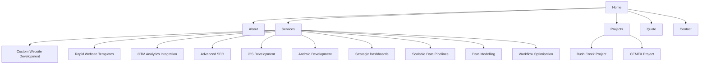
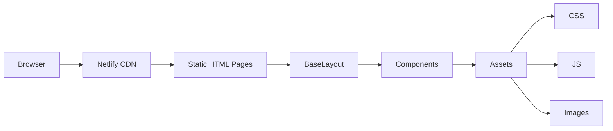
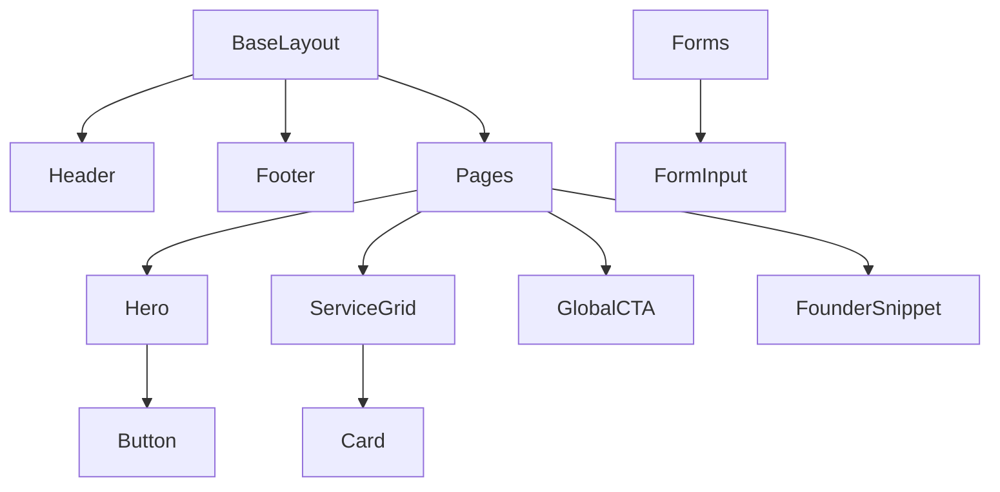
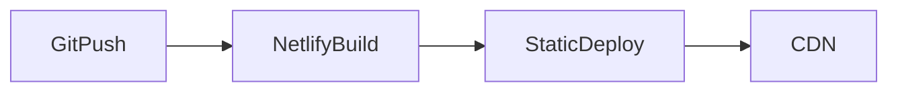

# Nexora Web Agency


High‑performance, componentized static website for a digital engineering agency. Built with **HTML, CSS, and Vanilla JavaScript** using a lightweight **layout + components architecture**, assembled via npm scripts and deployed through **Netlify CDN infrastructure**.

---

# Quick Start

Clone the repository:

```bash
git clone https://github.com/nwaagency/nwaagency.github.io.git
cd nwaagency.github.io
```

Install dependencies:

```bash
npm install
```

Start development:

```bash
npm run dev
```

If no dev server exists:

```bash
npx serve .
```

---

# Table of Contents

1. Overview
2. Technology Stack
3. Repository Structure
4. Source vs Public Architecture
5. Website Sitemap
6. Routing Architecture
7. Layout System
8. Component System
9. Styling Architecture
10. JavaScript Architecture
11. System Architecture
12. Component Dependency Graph
13. Performance Strategy
14. SEO Architecture
15. Security Architecture
16. Netlify Configuration
17. Development Environment
18. Development Workflow
19. Coding Standards
20. Git Workflow
21. Deployment Pipeline
22. Future Improvements
23. License

---

# Overview

Nexora Web Agency is a **static marketing and portfolio website** designed to:

* Present digital engineering services
* Showcase projects and case studies
* Capture leads through a multi‑step quote form

The system is intentionally built using **static architecture** to maximize:

* performance
* SEO visibility
* security
* deployment simplicity

Maintainability is achieved through:

* centralized **BaseLayout**
* reusable **HTML components**
* modular CSS layers
* minimal structured JavaScript
* strict separation between **source (`src/`) and assets (`public/`)**

---

# Technology Stack

## Frontend

* HTML (layout + component partials)
* CSS (custom design system)
* Vanilla JavaScript (UI interactions)

## Infrastructure

* Netlify (hosting + CDN)
* npm (build orchestration)

---

# Repository Structure

```text
├── public
│   ├── icons
│   └── images
├── src
│   ├── assets
│   │   ├── css
│   │   └── js
│   ├── components
│   │   ├── global
│   │   ├── sections
│   │   └── ui
│   ├── layouts
│   │   └── BaseLayout.html
│   └── pages
│       ├── services
│       ├── projects
│       ├── about.html
│       ├── contact.html
│       ├── index.html
│       ├── projects.html
│       ├── quote.html
│       ├── services.html
│       ├── template.html
│       └── thank-you.html
├── netlify.toml
├── package.json
└── README.md
```

---

# Source vs Public Architecture

## public/

Contains **static assets** referenced directly by HTML.

Examples:

* brand logos
* SVG icons
* founder imagery
* project screenshots

---

## src/

Contains the **structured website source**.

Key directories:

* `pages/` — route pages
* `layouts/` — shared layouts
* `components/` — reusable UI
* `assets/` — CSS and JavaScript

---

# Website Sitemap



---

# Routing Architecture

Routes are generated directly from:

```
src/pages
```

Examples:

| File                              | Route                         |
| --------------------------------- | ----------------------------- |
| index.html                        | /                             |
| about.html                        | /about                        |
| services.html                     | /services                     |
| services/android-development.html | /services/android-development |
| projects/bush-creek.html          | /projects/bush-creek          |

---

# Layout System

Location:

```
src/layouts/BaseLayout.html
```

Responsibilities:

* global document structure
* metadata configuration
* stylesheet loading
* header/footer inclusion
* page content slot

This layout ensures consistency across all pages.

---

# Component System

## Global Components

Location:

```
src/components/global
```

Examples:

* Header
* Footer

---

## Section Components

Location:

```
src/components/sections
```

Examples:

* Hero
* ServiceGrid
* FounderSnippet
* GlobalCTA

---

## UI Components

Location:

```
src/components/ui
```

Examples:

* Button
* Card
* FormInput

---

# Design System Documentation

The Nexora design system provides a consistent visual and interaction language across the entire website. It is implemented primarily through **CSS tokens, reusable UI components, and structured layout primitives**.

The goals of the design system are:

* visual consistency
* maintainability
* predictable UI behavior
* easy extensibility

---

## Design Tokens

Design tokens are defined inside:

```
src/assets/css/global.css
```

Typical tokens include:

* color palette
* spacing scale
* typography scale
* border radii
* elevation/shadow values

Example structure:

```css
:root {
  --color-primary-accent: #BB86FC;

  --color-bg-base: #121112;
  --color-bg-surface: #1E1E1E;

  --color-text-primary: #E0E0E0;
  --color-border-subtle: #333333;

  --radius-sm: 4px;
  --radius-md: 8px;
  --radius-lg: 16px;
}
```

Tokens should always be used instead of hardcoded values when styling components.

---

## Typography System

Typography is designed for **professional, developer‑focused readability**.

Primary font stack typically includes:

```
Inter, system-ui, sans-serif
```

Recommended scale:

| Role            | Example Size |
| --------------- | ------------ |
| Hero Heading    | 40–56px      |
| Section Heading | 28–36px      |
| Subheading      | 20–24px      |
| Body Text       | 16–18px      |
| Small Text      | 14px         |

Typography rules:

* maintain strong hierarchy
* avoid excessive font weights
* ensure accessible contrast

---

## Spacing System

Spacing should follow a **consistent scale** to maintain layout rhythm.

Typical scale:

```
4px
8px
16px
24px
32px
48px
64px
```

Spacing should be applied using utility classes or variables rather than arbitrary values.

---

## Component Patterns

Components are organized by abstraction level:

### UI Primitives

Location:

```
src/components/ui
```

Examples:

* Button
* Card
* FormInput

These components are designed to be **small, reusable building blocks**.

---

### Section Components

Location:

```
src/components/sections
```

Examples:

* Hero
* ServiceGrid
* FounderSnippet
* GlobalCTA

These compose primitives into larger layout sections.

---

### Global Components

Location:

```
src/components/global
```

Examples:

* Header
* Footer

These components appear across most pages.

---

## Interaction Patterns

Interactive elements follow consistent patterns:

Buttons:

* clear hover state
* subtle transition animations
* strong contrast

Forms:

* labeled inputs
* clear validation feedback
* predictable focus states

---

## Accessibility Guidelines

The design system aims to maintain accessibility standards:

* sufficient color contrast
* semantic HTML
* accessible form labels
* keyboard navigability

Future improvements may include:

* WCAG auditing
* automated accessibility testing

---

# Styling Architecture

CSS files are located in:

```
src/assets/css
```

Layered structure:

1. `global.css` — tokens and resets
2. `main.css` — layout and components
3. `utilities.css` — utility classes
4. `home.css` — page‑specific styling

---

# JavaScript Architecture

JavaScript modules are located in:

```
src/assets/js
```

### forms.js

Handles:

* multi‑step quote form
* validation
* submission readiness

JavaScript is intentionally minimal to maintain performance.

---

# System Architecture



---

# Component Dependency Graph



---

# Performance Strategy

Performance optimizations include:

* static rendering
* minimal JavaScript
* CDN distribution
* optimized images

Benefits:

* strong Core Web Vitals
* fast load times
* high Lighthouse scores

---

# SEO Architecture

SEO is supported through:

* dedicated service landing pages
* semantic HTML structure
* fast static rendering

Each service page targets a specific keyword cluster.

---

# Security Architecture

Security is enforced primarily through **Netlify edge configuration**.

Configured in:

```
netlify.toml
```

Typical protections:

* security headers
* HTTPS enforcement
* cache rules

Because the system is static, the **attack surface is minimal**.

---

# Netlify Configuration

`netlify.toml` defines:

* headers
* redirects
* routing rules

---

# Development Environment

Requirements:

* Node.js (LTS)
* npm
* Git

Recommended tools:

* VS Code
* Prettier
* ESLint

---

# Development Workflow

Create a new page:

1. Duplicate `template.html`
2. Place inside the appropriate directory
3. Update content

Create components:

* primitives → `ui/`
* sections → `sections/`
* layout elements → `global/`

---

# Coding Standards

## HTML

* semantic markup
* minimal nesting
* reusable components

## CSS

* use design tokens
* avoid hardcoded values
* isolate components

## JavaScript

* ES6 syntax
* modular structure
* avoid global state

---

# Git Workflow

Recommended branching model:

```
main
 ├─ feature/<feature>
 ├─ fix/<bug>
 └─ improvement/<task>
```

Workflow:

1. create branch
2. commit changes
3. open PR
4. review and merge

---

# Deployment Pipeline



Netlify handles:

* build pipeline
* CDN hosting
* edge configuration

---

